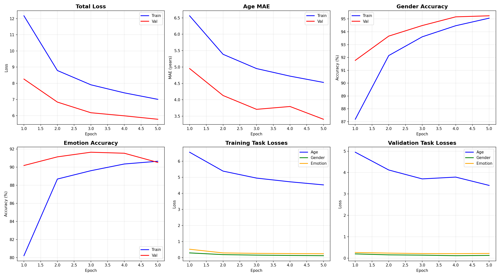
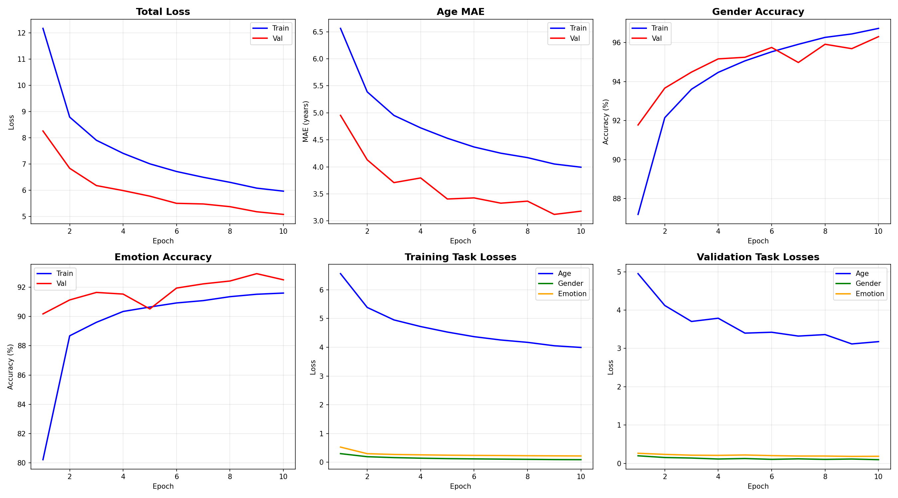
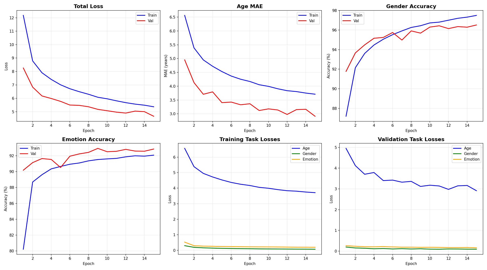
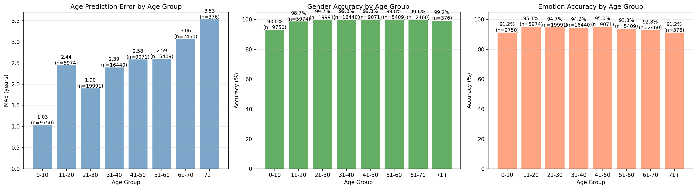

# AgeGenderEmo Model Training Results

## Training History Visualizations

### Epoch 5 Training Progress

### Epoch 10 Training Progress

### Epoch 15 Training Progress

### Final Training Results

---

## Test Results on FFHQ Dataset

### Overall Metrics
- **Total samples**: 69,471
- **Age MAE**: 2.13 ± 1.99 years
- **Gender Accuracy**: 98.72%
- **Emotion Accuracy**: 94.09%

### Test Results by Age Group

| Age Group | Samples | Age MAE (years) | Gender Acc (%) | Emotion Acc (%) |
|-----------|---------|-----------------|----------------|-----------------|
| 0-10      | 9,750   | 1.03           | 93.01          | 91.21           |
| 11-20     | 5,974   | 2.44           | 98.68          | 95.06           |
| 21-30     | 19,991  | 1.90           | 99.70          | 94.65           |
| 31-40     | 16,440  | 2.39           | 99.84          | 94.60           |
| 41-50     | 9,071   | 2.58           | 99.82          | 95.00           |
| 51-60     | 5,409   | 2.59           | 99.76          | 93.79           |
| 61-70     | 2,460   | 3.06           | 99.55          | 92.80           |
| 71+       | 376     | 3.53           | 99.20          | 91.22           |

### Metrics by Age Group Visualization

---

## Key Findings

### Age Prediction
- Best performance on young children (0-10): **1.03 years MAE**
- Best performance on young adults (21-30): **1.90 years MAE**
- Consistent performance across middle age groups (31-60): **~2.4-2.6 years**
- Slightly higher error for elderly (71+): **3.53 years**

### Gender Classification
- Excellent overall accuracy: **98.72%**
- Lower accuracy for children (0-10): **93.01%** (expected due to less distinct features)
- Near-perfect accuracy for adults (21-70): **99.5-99.8%**

### Emotion Recognition
- Strong overall accuracy: **94.09%**
- Consistent performance across age groups: **91-95%**
- Best performance on young adults (11-50): **94.6-95.1%**
- Slightly lower for children (0-10) and elderly (71+): **~91%**

---

## Model Information

- **Architecture**: AgeGenderNet (Custom ResNet + CBAM)
- **Parameters**: 9,356,776 (~35.7 MB)
- **Dataset**: FFHQ-Features (70,000 images with Azure annotations)
- **Training samples**: 58,331
- **Validation samples**: 9,735
- **Test samples**: 69,471
- **Best epoch**: 24
- **Best validation loss**: 4.2871

---

## Training Configuration

- **Batch size**: 64
- **Initial learning rate**: 0.0001
- **Optimizer**: Adam (weight_decay=1e-5)
- **Scheduler**: ReduceLROnPlateau (patience=5, factor=0.5)
- **Loss weights**: Age=1.0, Gender=10.0, Emotion=5.0
- **Early stopping**: patience=10 epochs
- **Total epochs**: 30
